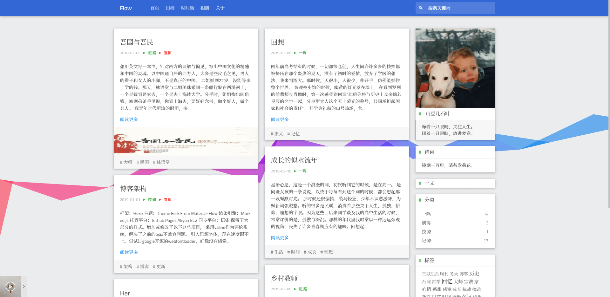

# blog

    

## Theme

Adapted from [stkevintan/hexo-theme-material-flow](https://github.com/stkevintan/hexo-theme-material-flow).

## Preview

 

## Installation

**1.** Make sure `node.js`, `npm` and `hexo-cli` are installed. `cnpm` is recommended.

**2.** This repo provide a example schema which your directory organization can follow.

```
.
├── .babelrc
├── .travis.yml
├── README.md
├── _config.yml
├── gallery.py
├── gulpfile.js
├── package-no-gulp.json
├── package.json
├── source
│   ├── 404.md
│   ├── CNAME
│   ├── _posts
│   ├── about
│   ├── assets
│   ├── essay
│   ├── gallery
│   ├── robots.txt
│   └── timeline
└── themes
    └── material-t
        ├── _config.yml
        ├── layout
        └── source
```
**3.** Current repo is deployed for my blog, please replace the key information when you use.

```
_config.yml (site configuration)
source (site content)
themes/material-t/_config.yml (theme configuration)
```

**4.** It is recommended to start with a simple version without `gulp` compression.

```
$ npm(cnpm) install
$ hexo g && hexo s
```

**5.** The version with `gulp` compression is also provided, use `package-no-gulp.json` as `package.json`.

**6.** `Travis CI` helps with automatic deployment of `hexo` blog, schema `.travis.yml` can be referenced.
